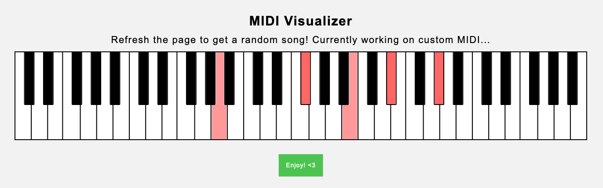

# MIDI Visualizer
Parsing & visualizing MIDI files in a user-friendly format. 

All contained in an HTML web page & minimal JavaScript.

## Functionality
MIDI Visualizer processes MIDI files to synthesize the song and create a full visualization of the notes played, using a popular visualization library called [d3](https://d3js.org/). I used d3 to construct the piano with lots of lines and rectangles. Similarly, the played notes of the MIDI file are SVG rectangles that overlay on top of the piano with a pink fill.

The music synthesized from the MIDI files comes from a library called [MIDIjs](http://www.midijs.net/), an open-source MIDI synthesizer built for pure JavaScript. As such, everything is portable and contained within a website. You can try out the project [here](https://trueshotbarrage.github.io/midi-visualizer/).

As of now, the visualizer only plays a few preset MIDI files, but I am planning to add functionality for users to try uploading their own MIDI file to synthesize. (It's going to take some time, as I need to have server-side interaction on the webpage, which means I need to redesign my existing website to allow for that.)

## How to use

Give the browser some time to download the necessary assets for MIDI synthesis. On a good connection, it shouldn't take longer than ~2 seconds. Once it is ready to play the animation, the button will turn from red to green, which means you can click it to play the animation. Enjoy!
 
## Changelog
* April 2nd, 2020
  * README file updated
  * Originally uploaded the "finalized" project around late March, as seen in commit history

## Known bugs
* Sometimes, clicking the button the split second it is ready may cause the visual animation to start without the music.
